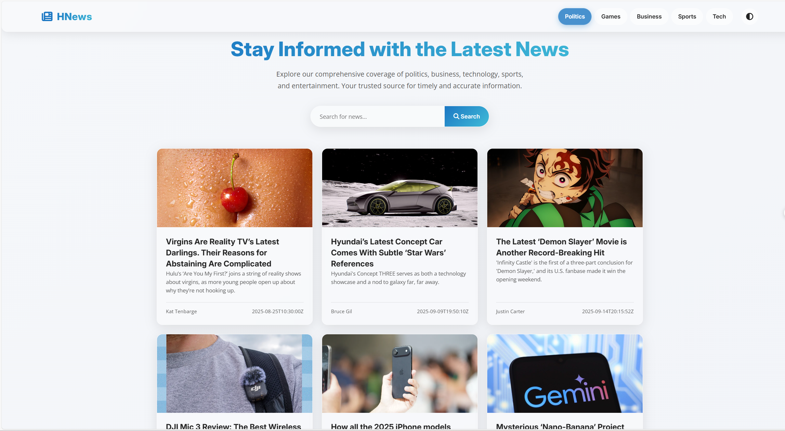
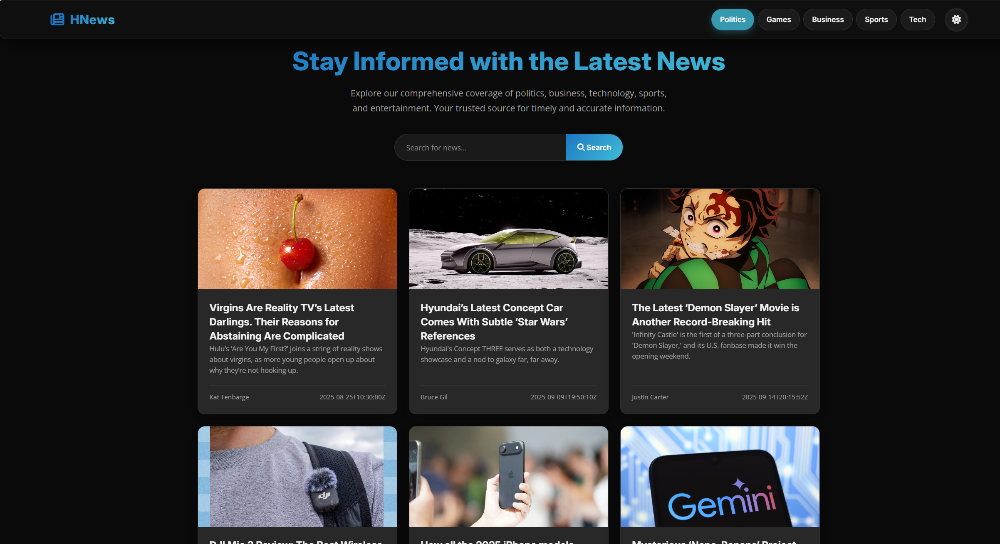

# HNews - Flask News Application

A simple and modern news web application built with Python and Flask. It fetches real-time news articles from the NewsAPI and displays them on a clean, responsive interface that includes both a light and a dark mode.

## Previews

| Light Mode | Dark Mode |
| :---: | :---: |
|  |  |

## Features

- Fetches live news from NewsAPI.
- Category-based navigation (Politics, Games, Business, etc.).
- Functional search bar to find news on any topic.
- Fully responsive design for desktop and mobile.
- Sleek user interface with glassmorphism effects.
- Light and dark theme toggle.
- Backend filtering to remove unwanted articles.

## How to Run

1.  **Prerequisites:**
    - Python 3
    - A free API key from newsapi.org

2.  **Clone the Project:**
    - Clone or download this repository to your local machine.

3.  **Install Dependencies:**
    - Open your terminal in the project directory.
    - It's recommended to use a virtual environment.
    - Run the command: pip install Flask requests python-dotenv

4.  **Set Up API Key:**
    - In the project's root folder, create a file named `.env`
    - Inside the `.env` file, add your API key like this:
      NEWS_API_KEY='YOUR_API_KEY_HERE'

5.  **Run the Server:**
    - In the terminal, run the command: python app.py
    - Open your web browser and go to: http://127.0.0.1:5050

